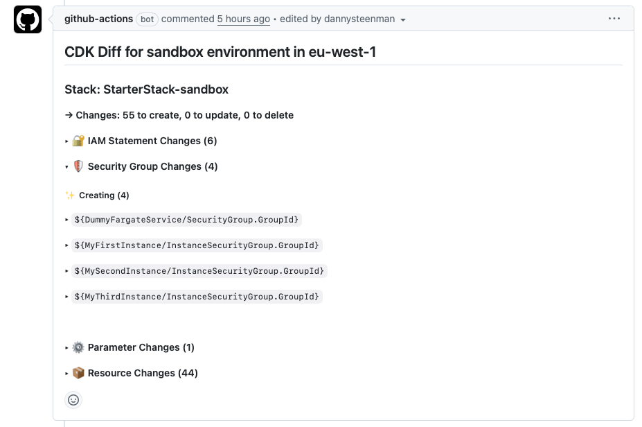

# AWS CDK Diff PR Commenter

A GitHub Action that posts the output of `cdk diff` as a comment on Pull Requests. This action helps teams review infrastructure changes directly within their PR workflow, making it easier to catch potential issues before deploying CDK changes.



## Features

- Automatically posts formatted CDK diff output to PR comments
- Updates existing comments instead of creating duplicates
- Skips posting when there are no changes
- Supports custom headers for better organization in multi-stack setups
- Parses and highlights IAM statement changes, Security Group changes, Parameters, and Resources
- This GitHub Action is developed using native JavaScript, so it executes way faster compared to an action build using Docker.


## Inputs

| Input        | Description                                                                                                                                                            | Required | Default               |
| ------------ | ---------------------------------------------------------------------------------------------------------------------------------------------------------------------- | -------- | --------------------- |
| `diff-file`  | Path to the CDK diff output file to post as comment in the Pull Request                                                                                                | Yes      | -                     |
| `token`      | The GitHub or PAT token to use for posting comments to Pull Requests                                                                                                   | No       | `${{ github.token }}` |
| `header`     | Set a custom header to use for the Pull Request comment. Useful when running multiple CDK diff comments in the same PR (e.g., "Dev Environment" vs "Prod Environment") | No       | -                     |
| `aws-region` | The AWS region where the infrastructure changes are being applied e.g. us-east-1                                                                                       | No       | -                     |

## Outputs

| Output     | Description                                                  |
| ---------- | ------------------------------------------------------------ |
| `markdown` | The raw markdown output of the `cdk diff` command            |
| `empty`    | Whether the `cdk diff` contains any changes (`true`/`false`) |

## Usage

### Example 1: Complete Workflow

```yaml
name: CDK Diff on Pull Request

on:
  pull_request:
    branches:
      - main

jobs:
  post-cdk-diff-comment:
    name: Post CDK Diff Comment to PR
    runs-on: ubuntu-latest
    permissions:
      contents: read
      id-token: write
      pull-requests: write
    env:
      AWS_REGION: us-east-1

    steps:
      - name: Checkout Repository
        uses: actions/checkout@v5
        with:
          ref: ${{ github.event.pull_request.head.sha }}

      - name: Setup Node.js
        uses: actions/setup-node@v5
        with:
          node-version: "22"
          cache: npm

      - name: Configure AWS Credentials
        uses: aws-actions/configure-aws-credentials@v4
        with:
          role-to-assume: arn:aws:iam::123456789012:role/GitHubActionsRole  # Replace with your IAM role ARN
          aws-region: ${{ env.AWS_REGION }}

      - name: Install Dependencies
        run: npm ci

      - name: CDK Diff
        run: |
          npx cdk diff --all --no-color > cdk-diff-output.txt 2>&1 || true

      - name: Post CDK Diff Comment
        uses: towardsthecloud/aws-cdk-diff-pr-commenter@v1
        with:
          diff-file: cdk-diff-output.txt
          aws-region: ${{ env.AWS_REGION }}
```

### Example 2: Reusable Workflow

Create a reusable workflow in `.github/workflows/post-cdk-diff-comment.yml`:

```yaml
name: Post CDK Diff Comment

on:
  workflow_call:
    inputs:
      diff-file:
        description: 'Path to the CDK diff output file'
        type: string
        required: true
      aws-region:
        description: 'AWS Region where resources are deployed'
        type: string

jobs:
  post-comment:
    name: Post CDK Diff Comment to PR
    runs-on: ubuntu-latest
    permissions:
      contents: read
      pull-requests: write

    steps:
      - name: Checkout Repository
        uses: actions/checkout@v5

      - name: Download CDK Diff
        uses: actions/download-artifact@v5
        with:
          name: cdk-diff-artifact

      - name: Post CDK Diff Comment
        uses: towardsthecloud/aws-cdk-diff-pr-commenter@v1
        with:
          diff-file: ${{ inputs.diff-file }}
          aws-region: ${{ inputs.aws-region }}
```

Then call this workflow from your main CDK diff workflow:

```yaml
name: CDK Diff on Pull Request

on:
  pull_request:
    branches:
      - main

jobs:
  generate-cdk-diff:
    name: Generate CDK Diff
    runs-on: ubuntu-latest
    permissions:
      contents: read
      id-token: write
    env:
      AWS_REGION: us-east-1

    steps:
      - name: Checkout Repository
        uses: actions/checkout@v5
        with:
          ref: ${{ github.event.pull_request.head.sha }}

      - name: Setup Node.js
        uses: actions/setup-node@v5
        with:
          node-version: "22"
          cache: npm

      - name: Configure AWS Credentials
        uses: aws-actions/configure-aws-credentials@v4
        with:
          role-to-assume: arn:aws:iam::123456789012:role/GitHubActionsRole  # Replace with your IAM role ARN
          aws-region: ${{ env.AWS_REGION }}

      - name: Install Dependencies
        run: npm ci

      - name: CDK Diff
        run: |
          npx cdk diff --all --no-color > cdk-diff-output.txt 2>&1 || true

      - name: Upload CDK Diff
        uses: actions/upload-artifact@v5
        with:
          name: cdk-diff-artifact
          path: cdk-diff-output.txt

  post-cdk-diff-comment:
    name: Post CDK Diff Comment
    needs: generate-cdk-diff
    uses: ./.github/workflows/post-cdk-diff-comment.yml
    with:
      diff-file: cdk-diff-output.txt
      aws-region: us-east-1
```

### Try It Out

Want to test this action? Check out the [AWS CDK Starter Kit](https://github.com/towardsthecloud/aws-cdk-starter-kit) we created. It's a production-ready CDK template with this workflow already configured.

## Permissions

This action requires the following permissions:

```yaml
permissions:
  contents: read        # Required to read repository contents
  pull-requests: write  # Required to post comments on PRs
```

If you're using AWS OIDC authentication (as shown in the examples above), you'll also need:

```yaml
permissions:
  id-token: write       # Required for AWS OIDC authentication
```

## Notes

- The action will update the same comment on subsequent pushes to the PR, avoiding comment spam
- No comment will be posted if the diff shows no changes
- The `diff-file` should contain the output of `cdk diff` (typically redirected to a file)
- The action automatically parses and highlights:
  - IAM Statement Changes
  - Security Group Changes
  - Parameter Changes
  - Resource Changes (additions, updates, removals)
- Use `--no-color` flag with `cdk diff` to ensure clean output parsing
- The action gracefully handles multiple stacks in a single diff output

## Author

Maintained by [Towards the Cloud](https://github.com/towardsthecloud)
