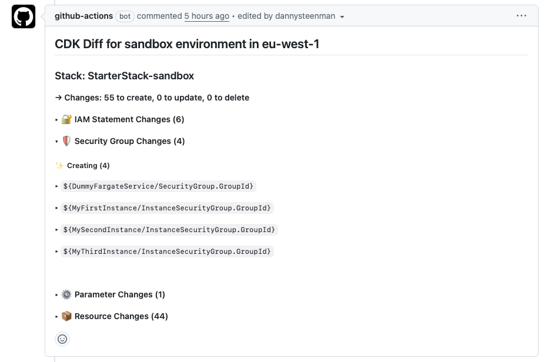

# AWS CDK Diff PR Commenter

A GitHub Action that posts the output of `cdk diff` as a comment on Pull Requests. This action helps teams review infrastructure changes directly within their PR workflow, making it easier to catch potential issues before deploying CDK changes.



## Features

- Automatically posts formatted CDK diff output to PR comments
- Updates existing comments instead of creating duplicates
- Optionally skips posting when there are no changes
- Supports custom headers for better organization in multi-stack setups
- Parses and highlights IAM statement changes, Security Group changes, Parameters, and Resources
- This GitHub Action is developed using native JavaScript, so it executes way faster compared to an action build using Docker.

<!-- TIP-LIST:START -->
> [!TIP]
> **Now you can see _what's_ changing in your infrastructure. But what about _how much it will cost_?**
>
> We developed a GitHub App called [CloudBurn](https://cloudburn.io) that automatically analyzes your CDK diffs and adds cost impact analysis right in your PR comments. Catch expensive decisions before they hit production, not weeks later on your AWS bill.
>
> <a href="https://github.com/apps/cloudburn-io"></a>
>
> <details>
> <summary>💰 <strong>Two-minute setup</strong></summary>
> <br/>
>
> 1. **[Install CloudBurn](https://github.com/apps/cloudburn-io)** on the same repository where you use this action
> 2. **Open a PR** – This action posts the CDK diff, then CloudBurn reads it and adds a separate comment with cost analysis
>
> **What's included:**
>
> - Monthly cost deltas showing exactly how much your changes will increase or decrease your AWS bill
> - Real-time pricing from AWS Pricing API based on your infrastructure's region
> - Per-resource cost breakdowns with old vs. new monthly costs
> - Free forever for 1 repository with unlimited users
>
> </details>
<!-- TIP-LIST:END -->

## Inputs

| Input        | Description                                                                         | Required | Default               |
| ------------ | ----------------------------------------------------------------------------------- | -------- | --------------------- |
| `diff-file`  | Path to the CDK diff output file to post as comment in the Pull Request             | Yes      | -                     |
| `token`      | The GitHub or PAT token to use for posting comments to Pull Requests                | No       | `${{ github.token }}` |
| `header`     | Header to use for the Pull Request comment                                          | No       | -                     |
| `aws-region` | The AWS region where the infrastructure changes are being applied (e.g., us-east-1) | No       | -                     |

## Outputs

| Output     | Description                                                  |
| ---------- | ------------------------------------------------------------ |
| `markdown` | The raw markdown output of the `cdk diff` command            |
| `empty`    | Whether the `cdk diff` contains any changes (`true`/`false`) |

## Usage

### Example 1: Direct Usage in Workflow

```yaml
name: CDK Diff and Comment on PR

on:
  pull_request:
    branches:
      - main

permissions:
  contents: read
  id-token: write
  pull-requests: write

jobs:
  diff-and-comment:
    name: Run CDK Diff and Post PR Comment
    runs-on: ubuntu-latest

    steps:
      - name: Checkout Repository
        uses: actions/checkout@v5
        with:
          ref: ${{ github.event.pull_request.head.sha }}

      - name: Setup Node.js
        uses: actions/setup-node@v5
        with:
          node-version: "22"
          cache: npm

      - name: Configure AWS Credentials
        uses: aws-actions/configure-aws-credentials@v4
        with:
          role-to-assume: arn:aws:iam::123456789012:role/GitHubActionsRole  # Replace with your IAM role ARN
          aws-region: us-east-1

      - name: Install Dependencies
        run: npm ci

      - name: CDK Diff
        run: |
          npx cdk diff --all --no-color > cdk-diff-output.txt 2>&1 || true

      # Add this action to your workflow ↓
      - name: Post CDK Diff Comment in PR
        uses: towardsthecloud/aws-cdk-diff-pr-commenter@v1
        with:
          diff-file: cdk-diff-output.txt
          aws-region: us-east-1
```

### Example 2: Reusable Workflow Call

Create a reusable workflow in `.github/workflows/cdk-diff-comment.yml`:

```yaml
name: Reusable CDK Diff PR Comment

on:
  workflow_call:
    inputs:
      diff-file:
        description: 'Path to the CDK diff output file'
        type: string
        required: true
      aws-region:
        description: 'AWS Region where resources will be deployed'
        type: string

jobs:
  comment-cdk-diff:
    name: Post CDK Diff as PR Comment
    runs-on: ubuntu-latest
    permissions:
      contents: read
      pull-requests: write

    steps:
      - name: Checkout Repository
        uses: actions/checkout@v5

      - name: Download Diff Artifact
        uses: actions/download-artifact@v5
        with:
          name: cdk-diff-artifact

      # Add this action to your workflow ↓
      - name: Post CDK Diff Comment in PR
        uses: towardsthecloud/aws-cdk-diff-pr-commenter@v1
        with:
          diff-file: ${{ inputs.diff-file }}
          aws-region: ${{ inputs.aws-region }}
```

Then call this workflow from your main CDK workflow:

```yaml
name: CDK Diff with Artifact Upload

on:
  pull_request:
    branches:
      - main

jobs:
  diff-infrastructure:
    name: Generate and Upload CDK Diff
    runs-on: ubuntu-latest
    permissions:
      contents: read
      id-token: write

    steps:
      - name: Checkout Repository
        uses: actions/checkout@v5
        with:
          ref: ${{ github.event.pull_request.head.sha }}

      - name: Setup Node.js
        uses: actions/setup-node@v5
        with:
          node-version: "22"
          cache: npm

      - name: Configure AWS Credentials
        uses: aws-actions/configure-aws-credentials@v4
        with:
          role-to-assume: arn:aws:iam::123456789012:role/GitHubActionsRole  # Replace with your IAM role ARN
          aws-region: us-east-1

      - name: Install Dependencies
        run: npm ci

      - name: CDK Diff
        run: |
          npx cdk diff --all --no-color > cdk-diff-output.txt 2>&1 || true

      - name: Upload Diff Artifact
        uses: actions/upload-artifact@v5
        with:
          name: cdk-diff-artifact
          path: cdk-diff-output.txt
          retention-days: 1

  post-diff-comment:
    needs: diff-infrastructure
    uses: ./.github/workflows/cdk-diff-comment.yml
    with:
      diff-file: cdk-diff-output.txt
      aws-region: us-east-1
```

Want to test this out first? Check out the [AWS CDK Starter Kit](https://github.com/towardsthecloud/aws-cdk-starter-kit) we created. It's a production-ready CDK template that has a GitHub workflow already configured to use this GitHub Action.

## Permissions

This action requires the following permissions:

```yaml
permissions:
  contents: read        # Required to read repository contents
  pull-requests: write  # Required to post comments on PRs
```

If you're using AWS OIDC authentication (as shown in the examples above), you'll also need:

```yaml
permissions:
  id-token: write       # Required for AWS OIDC authentication
```

## Usage-based cost assumptions

CloudBurn prices S3, SQS, and SNS from monthly usage you declare, since a diff shows that a bucket or queue exists but never how much traffic it will carry.

Put those numbers in `.cloudburn/usage-assumptions.json` at the root of your repository:

```json
{
  "schemaVersion": 2,
  "resources": {
    "StorageStack/ReportsBucket": {
      "s3": { "storage": { "standardGbMonth": 500 } }
    }
  }
}
```

Keys under `resources` are construct paths: the stack name followed by the path to the construct.

When the file is present, this action appends it to the diff comment inside a collapsed **CloudBurn usage assumptions** block, together with the version of the file at the pull request base commit. CloudBurn reads both from the comment and never reads your repository, so editing only the assumptions still produces a cost delta.

Repositories without the file get the same comment as before. A file over 64 KB or with invalid JSON isn't embedded; CloudBurn reports it as a configuration error instead.

The [usage assumptions schema reference](https://cloudburn.io/docs/cloud/github-app/usage-assumptions) covers the full schema: supported fields per service, repository-wide and per-resource-type defaults, account usage for graduated pricing tiers, and free-tier handling.

## Documentation

For complete documentation, including advanced configuration options and integration with CloudBurn for cost analysis, visit:

[Full Documentation on CloudBurn.io](https://cloudburn.io/docs/cloud/github-app)

## Author

Maintained by [Towards the Cloud](https://towardsthecloud.com)
